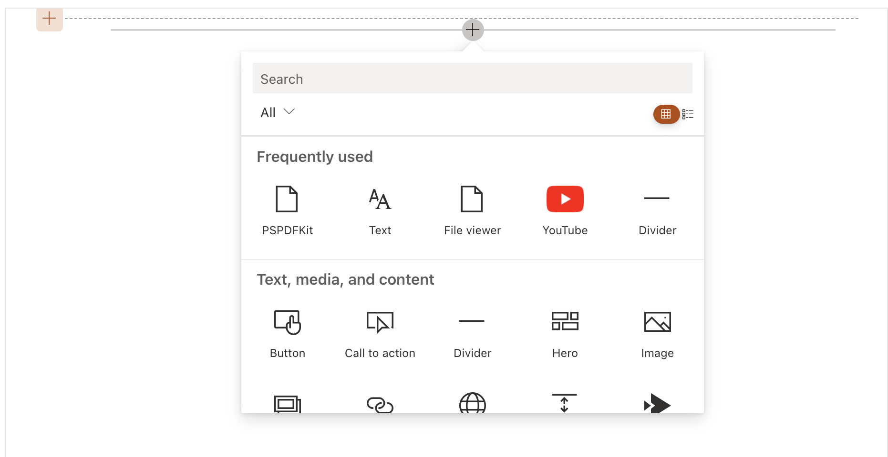
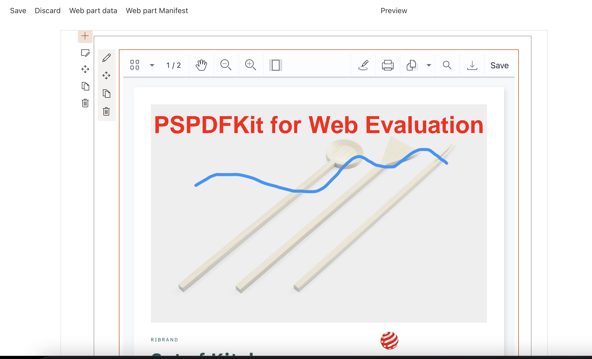
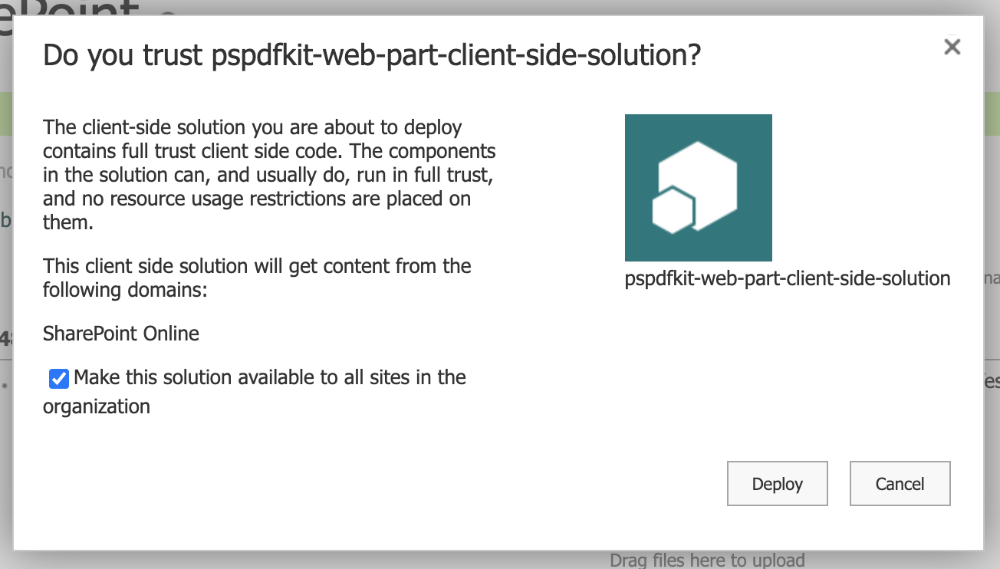
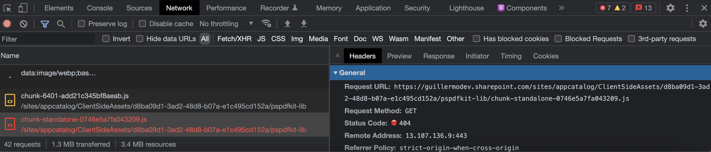
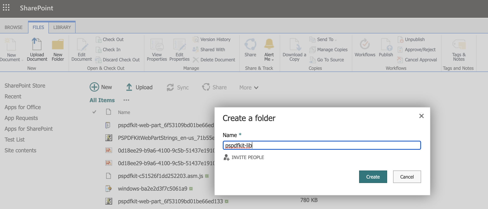
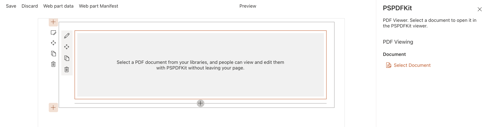

# Example SharePoint integration with PSPDFKit

## Slide show presentation/tutorial

Please check [this link](https://docs.google.com/presentation/d/1qy0hDQOMeU6WSi7pTKkuAf7WTpvaZQD7dk1eERWWbMA/edit?usp=sharing) for a complete walkthrough of this SharePoint web part project.

## Applies to

- [SharePoint Framework](https://aka.ms/spfx)
- [Microsoft 365 tenant](https://docs.microsoft.com/en-us/sharepoint/dev/spfx/set-up-your-developer-tenant)

## Installation and deployment

Step 0. Please make sure to have Node.js v14 installed

Step 1. Clone this repository

Step 2. Open `./config/serve.json` in your project and locate the property `initialPage`

Step 3. Replace `enter-your-SharePoint-site` domain to the URL of your SharePoint tenant and site you want to use for testing.

Step 4. Ensure that you are at the solution folder

Step 5. in the command-line run:
  - **npm install**
  -  If it's the first time, also [follow these instructions to set-up a dev certificate](https://docs.microsoft.com/en-us/sharepoint/dev/spfx/set-up-your-development-environment#trusting-the-self-signed-developer-certificate).
     - Make sure to run `gulp trust-dev-cert`.
  - **npm run serve**

The browser should open at the URL specified on step 3.

Screenshot from SharePoint showing how to add the PSPDFKit web part into a page.

Screenshot of the PSPDFKit web part once added.

> **Note:** For production, you need to follow these steps to get it deployed into your SharePoint environment.
>
> **Step 1:** For production run `npm run bundle` and then `npm run package`. 
> 
> **Step 2:** Then, follow the steps [on this link](https://docs.microsoft.com/en-us/sharepoint/dev/spfx/web-parts/get-started/using-web-part-as-ms-teams-tab#package-and-deploy-your-web-part-to-sharepoint) to get it deployed in SharePoint Online and Microsoft Teams. If a previous installation already exists, it's recommended to remove it before proceeding.
>
> Please make sure to select "Make this solution available to all sites in the organization" in the confirmation dialog that appears after dragging the package.
> 
>
> **Step 3:** Navigate to the [workbench](https://docs.microsoft.com/en-us/sharepoint/dev/spfx/web-parts/get-started/build-a-hello-world-web-part#update-your-projects-hosted-workbench-url) of one of your SharePoint sites and add the PSPDFKit web part there.
>
> **Step 4:** There's an issue getting SharePoint to bundle the static assets of PSPDFKit for Web under the correct subdirectory when using the SharePoint file system itself as CDN, instead of a custom one (You can specify a custom URL for the static assets under `write-manifests.json`) so if you see a network error when requesting one of the chunks for the PSPDFKit library:
> 
> This happens because the `pspdfkit-lib` subdirectory is not created by SharePoint. To fix this, navigate to the erroring URL but trim its path before the `pspdfkit-lib` segment (i.e. `https://<your-sharepoint-site>/sites/appcatalog/ClientSideAssets/<some-hash>`) and create a `pspdfkit-lib` folder.
> 
> Then you can copy over the contents from `<project-root>/sharepoint/solution/debug/ClientSideAssets/pspdfkit-lib` over the newly created folder.
> 
> **_Note:_** As an alternative to this step, consider hosting the assets into some CDN and set into the `write-manifests.json` file.
> 
> **Step 5:** Your PSPDFKit instance should now work.  Try opening your [workbench](https://docs.microsoft.com/en-us/sharepoint/dev/spfx/web-parts/get-started/build-a-hello-world-web-part#update-your-projects-hosted-workbench-url) and check if the PSPDFKit web part appears as part of the list of available web parts to add.

## Project Structure

The core of this project is the `/src/webparts/PSPDFKit/PSPDFKitWebPart.tsx` file. It contains the instructions on how to render our custom SharePoint web part. In this case, it delegates the rendering to the `PSPDFKitViewer` React component, located in the `/src/webparts/PSPDFKit/component/PSPDFKitViewer.tsx` path.

Also, in `/src/webparts/PSPDFKit/PSPDFKitWebPart.tsx` the rendering of the properties panel is specified.

The property panel at the right portion of the previous screenshot shows how to select the document to open.

## Configuration files

### File: `config.json`

The main configuration is done in the `/config/config.json` file. Where the different web parts to be deployed and their entry points are specified.

### File: `package-solution.json`

The file `package-solution.json` in the same directory, which contains metadata about the name, developer information etc.

The `includeClientSideAssets`, `isDomainIsolated` are important properties to make sure that the web part is finally deployed in the SharePoint site, it is with the additional assets.

### File: `serve.json`

`serve.json` allows you to specify the SharePoint environment to use during development. Specifically, the `initialPage` value will be the one used when running `gulp serve` as destination for the web part.

### File: `write-manifests.json`

`write-manifests.json` has been left with default value, but a custom path where the static assets required by the web part are stored can be specified in the `cdnBasePath` property.

## Examples

Check the `PDF examples` directory for some example files that you can upload to your SharePoint site and test the viewer with.

* `Example with annotations.pdf`: Check some of the supported annotation types that you can create, modify or delete within the 
PSPDFKit viewer.
* `Credit application form.pdf`: Add annotations, notes, check the boxes, and sign the document (via drawing, typing or inserting an image).
* `Brochure with images.pdf`: Contains text and images in a document. You can try annotating.
* `Constallation render quality.pdf`: Zoom in and zoom out to see the rendering quality.

## References and links

- [Getting started with SharePoint Framework](https://docs.microsoft.com/en-us/sharepoint/dev/spfx/set-up-your-developer-tenant)
- [Building for Microsoft teams](https://docs.microsoft.com/en-us/sharepoint/dev/spfx/build-for-teams-overview)
- [Use Microsoft Graph in your solution](https://docs.microsoft.com/en-us/sharepoint/dev/spfx/web-parts/get-started/using-microsoft-graph-apis)
- [Publish SharePoint Framework applications to the Marketplace](https://docs.microsoft.com/en-us/sharepoint/dev/spfx/publish-to-marketplace-overview)
- [Microsoft 365 Patterns and Practices](https://aka.ms/m365pnp) - Guidance, tooling, samples and open-source controls for Microsoft 365 development